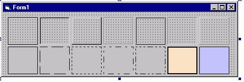



## Extended windowless frame control

### Description

A nice non-container Frame-Control. 

Note that there is no window-handle for this control. 

So it saves your system resources 

 

Features :  

- Styles Raised, Sunken, Etched, Inset etc. 

- BackStyle (Solid/Transparent) 

- BackColor 

- BorderColor 

 

Ejoy. Votes are welcome. 
 
### More Info
 
Enclosed Zip contains well commented Sourcecode, a Test-Project-Group and the compiled OCX.

             |
---                |---
**Submitted On**   |2001-03-06 11:47:28
**By**             |[Morpheus](https://github.com/Planet-Source-Code/PSCIndex/blob/master/ByAuthor/morpheus.md)
**Level**          |Intermediate
**User Rating**    |4.9 (59 globes from 12 users)
**Compatibility**  |VB 4\.0 \(32\-bit\), VB 5\.0, VB 6\.0, VBA MS Access
**Category**       |[Custom Controls/ Forms/  Menus](https://github.com/Planet-Source-Code/PSCIndex/blob/master/ByCategory/custom-controls-forms-menus__1-4.md)
**World**          |[Visual Basic](https://github.com/Planet-Source-Code/PSCIndex/blob/master/ByWorld/visual-basic.md)
**Archive File**   |[CODE\_UPLOAD16073362001\.zip](https://github.com/Planet-Source-Code/morpheus-extended-windowless-frame-control__1-21546/archive/master.zip)

### API Declarations

just a few

